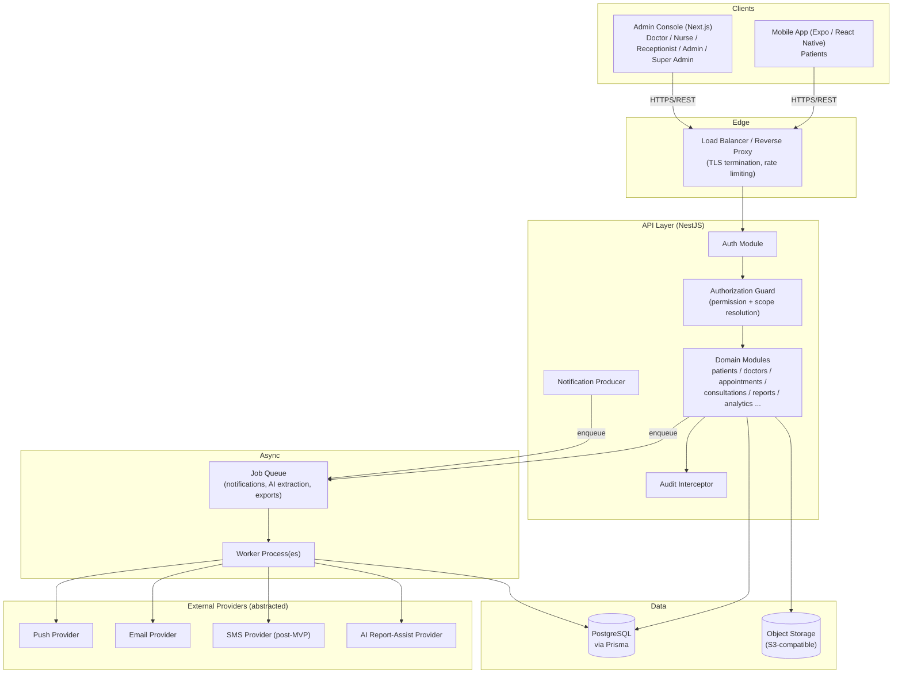

# 11 — System Architecture

## High-level diagram

## Component responsibilities

- **Mobile app / Admin console**: thin clients. All business rules and authorization live server-side; clients render server-declared state (e.g. disabled actions are driven by server-returned permission/eligibility flags, not just client heuristics — client heuristics only improve perceived responsiveness, they're never the actual authorization).
- **Load balancer / reverse proxy**: TLS termination, HTTP-level rate limiting (defense in depth alongside app-level limiting), request size limits, static security headers.
- **NestJS API**: single deployable service in MVP (modular monolith — see [ADR-001](43-ARCHITECTURE-DECISIONS.md)), organized into feature modules matching the API domains in [15-API-SPECIFICATION.md](15-API-SPECIFICATION.md). Cross-cutting concerns (auth, RBAC, audit, validation, rate limiting) implemented as global guards/interceptors/pipes so no domain module can accidentally skip them.
- **Authorization guard**: resolves `(permission, scope)` for every route from the route's declared required-permission metadata + the requester's role/assignment data + the target resource's tenant/ownership, before the handler runs. See [17-AUTHORIZATION-RBAC.md](17-AUTHORIZATION-RBAC.md).
- **Audit interceptor**: wraps every mutating (and select sensitive-read) endpoint, writing an `AuditLog` row after successful completion, including on responses that partially fail downstream (audit write itself is fire-and-forget-safe — see [24-AUDIT-LOGGING.md](24-AUDIT-LOGGING.md) for durability strategy).
- **Job queue + workers**: decouples slow/unreliable operations (notification delivery, AI report extraction, CSV export generation, activation-link emails) from the request/response cycle. See [ADR-009](43-ARCHITECTURE-DECISIONS.md) for the MVP queue technology choice.
- **PostgreSQL via Prisma**: single relational store, one schema, tenant-partitioned by `hospitalId` column (not separate databases/schemas per tenant — see [18-MULTI-TENANCY.md](18-MULTI-TENANCY.md) for the tradeoff).
- **Object storage abstraction**: a storage-provider interface (`packages/shared` or a dedicated API module) with a local-disk implementation for dev and an S3-compatible implementation for staging/production, so no domain code depends on a specific provider SDK.
- **External providers**: push (Expo Push / FCM), email (transactional email API), SMS (post-MVP), and an AI report-assist provider — all accessed through provider-abstraction interfaces so they're swappable and mockable in tests.

## Request lifecycle (representative: booking an appointment)

1. Mobile app calls `POST /appointments` with access token.
2. Edge LB terminates TLS, applies rate limit, forwards to API.
3. Auth guard validates JWT, attaches `RequestUser` (id, roles, permissions, hospital/branch assignment) to the request context.
4. Authorization guard checks the route requires `appointments.create`; resolves scope (Patient booking self vs Receptionist booking on behalf) and confirms the target patient/doctor belong to the same Hospital as the actor (tenant check).
5. Validation pipe validates the DTO against the Zod/class-validator schema shared with clients via `packages/validation`.
6. Domain service executes the booking transaction against PostgreSQL (see [19-APPOINTMENT-ENGINE.md](19-APPOINTMENT-ENGINE.md) for the conflict-safe transaction strategy).
7. On success: audit interceptor writes `APPOINTMENT_CREATE`; notification producer enqueues a confirmation job.
8. Worker picks up the job asynchronously, calls the push/email provider, updates `Notification.deliveryStatus`.
9. API returns the created `Appointment` resource to the client.

## Deployment topology (see [32-DEPLOYMENT.md](32-DEPLOYMENT.md) for full detail)

- Local/dev: `docker-compose` running Postgres, API, worker, admin (Next.js dev server), object storage emulator (e.g. MinIO); mobile runs via Expo Go/dev client against the local API.
- Staging/Production: containerized API + worker behind a load balancer, managed PostgreSQL, managed S3-compatible storage, admin deployed as a Next.js server (Node runtime, not static export, since it needs server components + auth), mobile distributed via EAS builds.

## Why a modular monolith, not microservices, for MVP

A single NestJS service with clean module boundaries gives transactional integrity for appointment-conflict logic (single database transaction, no distributed-transaction complexity), simpler operations for a small team, and faster iteration during Stage 2. Module boundaries are still enforced (no cross-module direct repository access — go through the module's service layer) so a future extraction into separate services remains possible without a rewrite. Recorded as [ADR-001](43-ARCHITECTURE-DECISIONS.md).
