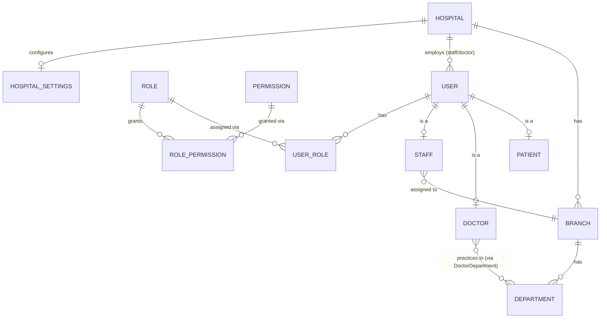
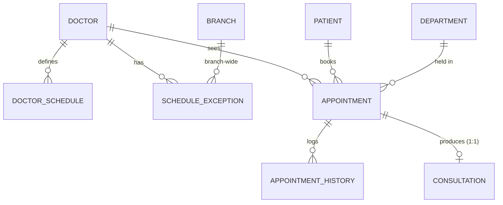
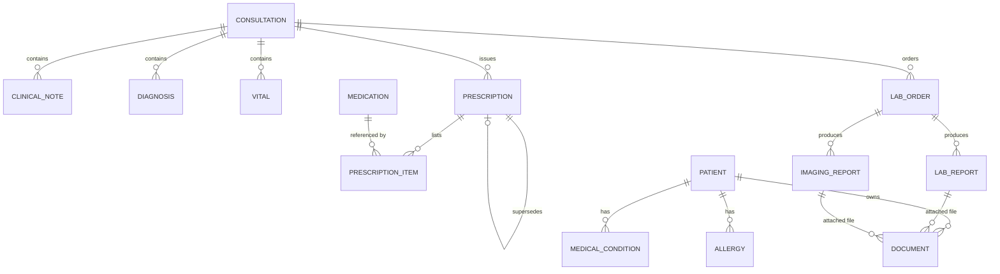
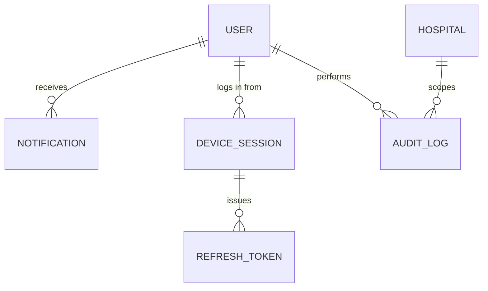
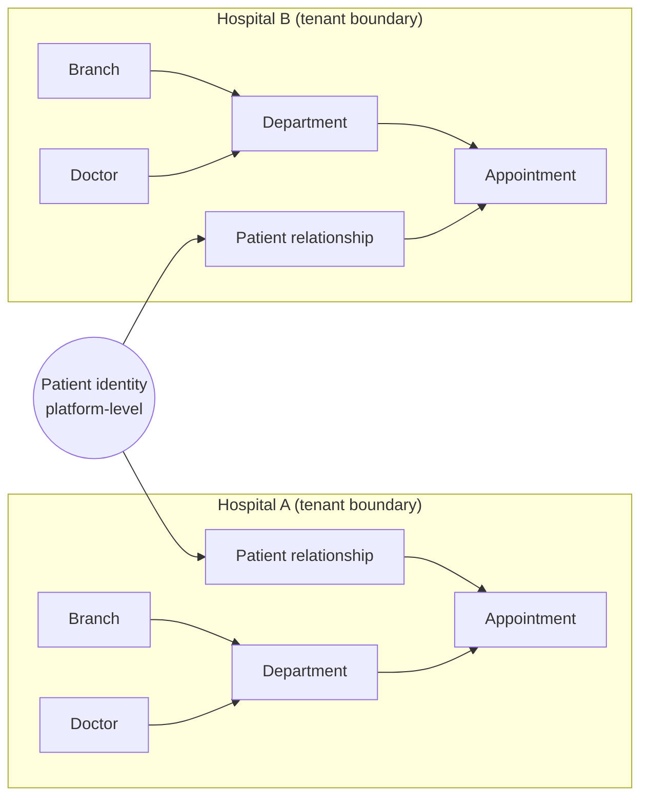

# 14 — Database ERD

Entity/field detail: [13-DATABASE-DESIGN.md](13-DATABASE-DESIGN.md). Diagrams split by domain for readability; all entities share the same underlying schema.

## Identity & Tenancy

## Scheduling & Appointments

## Clinical Records

## Platform Services

## Full entity relationship summary (text form)

| Parent | Relationship | Child | Cardinality |
|---|---|---|---|
| Hospital | owns | Branch | 1:N |
| Branch | contains | Department | 1:N |
| Hospital | employs | User (staff/doctor) | 1:N |
| User | is | Patient / Doctor / Staff | 1:0..1 each (mutually typical, not enforced exclusive at DB level — a user is expected to occupy exactly one of these in practice) |
| Doctor | practices in | Department | N:M via DoctorDepartment |
| Doctor | defines | DoctorSchedule | 1:N |
| Doctor / Branch | has | ScheduleException | 1:N |
| Doctor, Patient, Department | produce | Appointment | N:1 each |
| Appointment | logs to | AppointmentHistory | 1:N |
| Appointment | produces | Consultation | 1:1 |
| Consultation | contains | ClinicalNote, Diagnosis, Vital | 1:N each |
| Consultation | issues | Prescription | 1:N |
| Prescription | lists | PrescriptionItem | 1:N |
| Prescription | supersedes | Prescription | 0..1 self-referential |
| Consultation | orders | LabOrder | 1:N |
| LabOrder | produces | LabReport / ImagingReport | 1:N |
| Patient | has | MedicalCondition, Allergy, Document | 1:N each |
| LabReport / ImagingReport | attaches | Document | 1:N |
| User | receives | Notification | 1:N |
| User | authenticates via | DeviceSession → RefreshToken | 1:N → 1:N |
| Hospital / User | performs | AuditLog | 1:N each |
| Role | grants | Permission | N:M via RolePermission |
| User | assigned | Role | N:M via UserRole |
| Hospital | configures | HospitalSettings | 1:1 |

## Tenant-boundary rule (visual)

A single `Patient` identity can hold relationships (appointments, records) in both Hospital A and Hospital B, but every clinical row (`Appointment`, `Consultation`, `Prescription`, `LabReport`, …) carries exactly one `hospitalId` and is never joined across tenants except by `SUPER_ADMIN` platform queries. See [18-MULTI-TENANCY.md](18-MULTI-TENANCY.md).
